# App Base

A starter Android app using Kotlin, AndroidX, ViewBinding, Navigation Component, and Firebase (Auth + FCM) with Google Sign-In integration.

## Setup

1. Open this project in Android Studio Meerkat 2024.3.2 Patch 1 or newer.
2. Download your `google-services.json` from Firebase Console and place it in `app/`.
3. Enable Google Sign-In in Firebase Console:
   - Go to Firebase Console > Authentication > Sign-in method
   - Enable Google Sign-In provider
   - Add your app's SHA-1 fingerprint to the project settings
4. Sync Gradle and run the app.

### Face Recognition Setup Notes
- No additional API keys required (on-device ML Kit face detection)
- Permissions handled at runtime: Camera, and Storage (only on Android 12 and lower)
- Uses Android 13+ Photo Picker when available (no storage permission needed)

### OCR Setup Notes
- No additional API keys required (on-device ML Kit text recognition)
- Permissions handled at runtime: Camera, and Storage (only on Android 12 and lower)
- Uses Android 13+ Photo Picker when available (no storage permission needed)
- Supports multiple languages: English, Chinese, Japanese, Korean, and Devanagari
- Automatic language detection based on recognized text patterns

## Features
- Single-Activity architecture with Navigation Component
- Main Menu with four core feature options (Face Recognition, Object Detection, OCR, Navigation)
- Sign-In screen with Google authentication
- User profile display with photo, name, and email
- Sign-out functionality
- Firebase Authentication and Cloud Messaging (FCM) integrated
- Anonymous authentication support
- Material Design UI components
- Responsive layout for different screen sizes
- **Face Recognition (ML Kit)**: capture or pick an image, on-device face detection, bounding boxes overlay, face count, and details
- **OCR (Optical Character Recognition)**: extract text from images using ML Kit Text Recognition API with multi-language support, camera capture, gallery selection, and text sharing capabilities

## Dependencies
- AndroidX
- Kotlin
- Navigation Component
- Firebase Auth
- Firebase Cloud Messaging
- Google Play Services Auth
- Glide (for image loading)
- ML Kit Face Detection (on-device)
- **ML Kit Text Recognition** (on-device OCR for multiple languages)
- **CameraX** (camera integration for OCR)
- **Kotlin Coroutines** (asynchronous OCR processing)

## 📸 Screenshots

<div style="text-align: center;">
  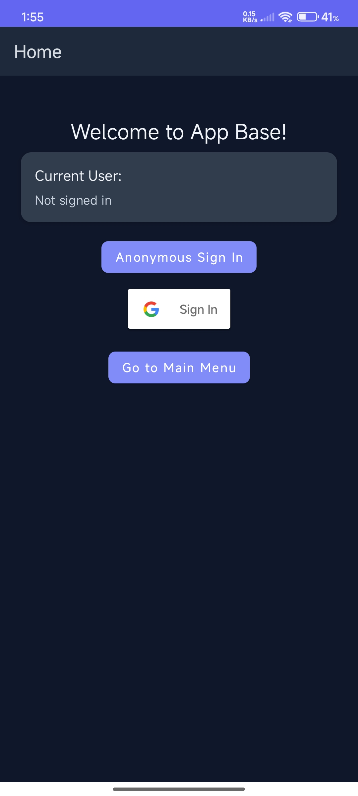
  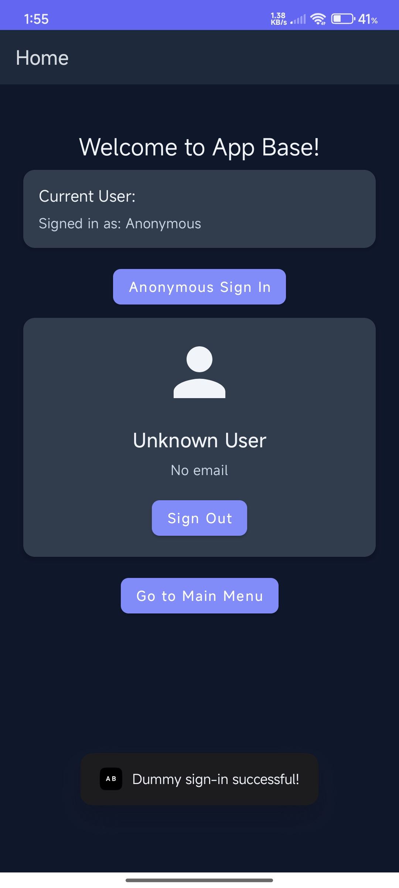
</div>

<div style="text-align: center;">
  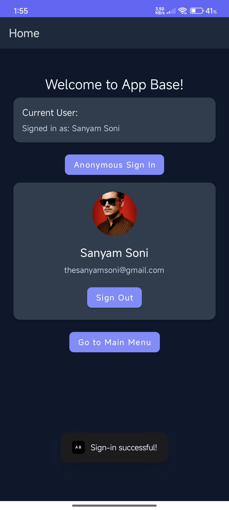
  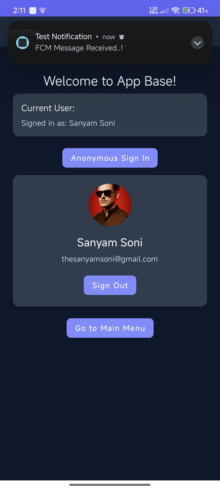
</div>

<div style="text-align: center;">
  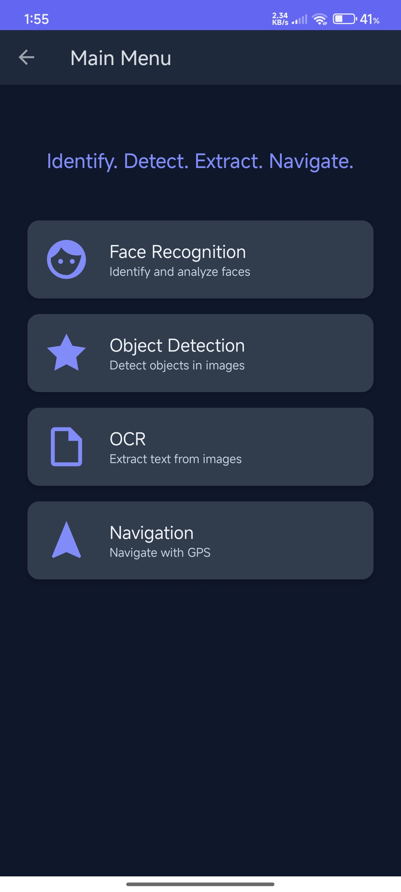
  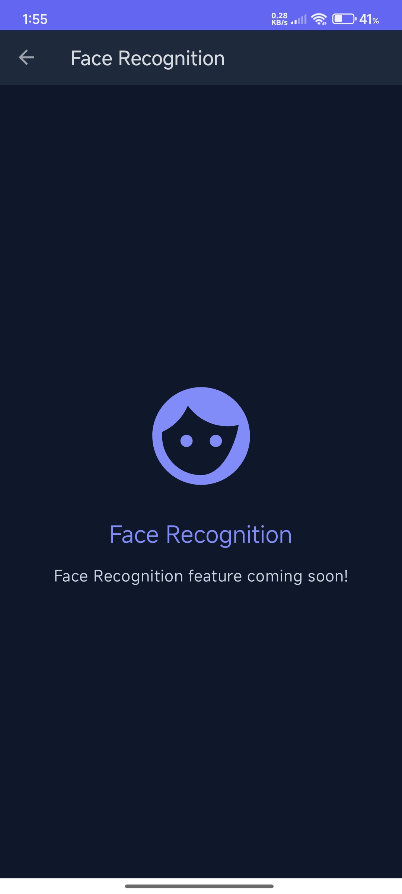
</div>

<div style="text-align: center;">
  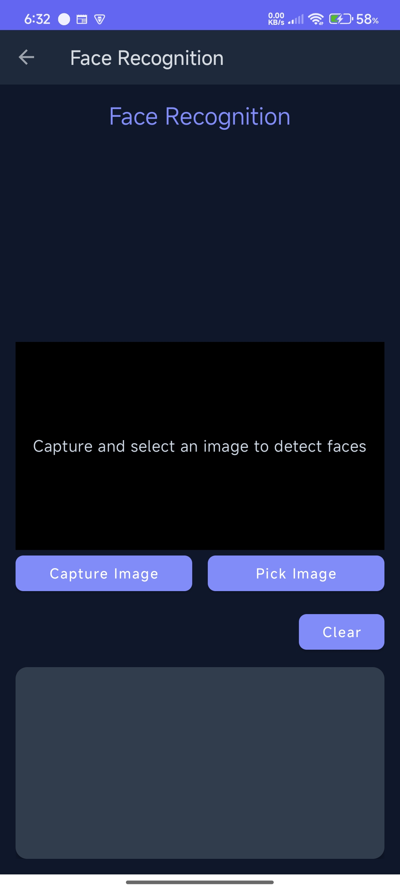
  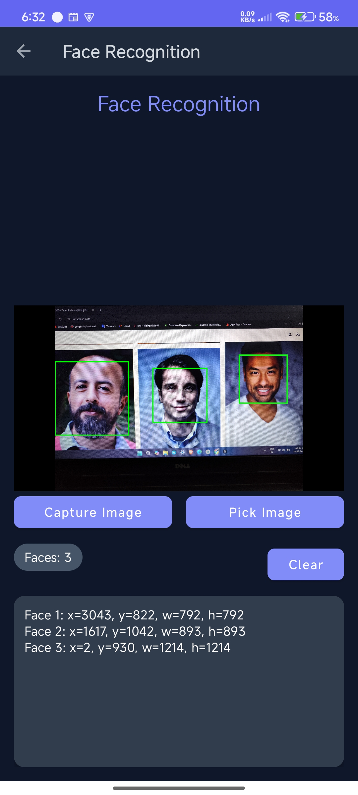
</div>

<div style="text-align: center;">
  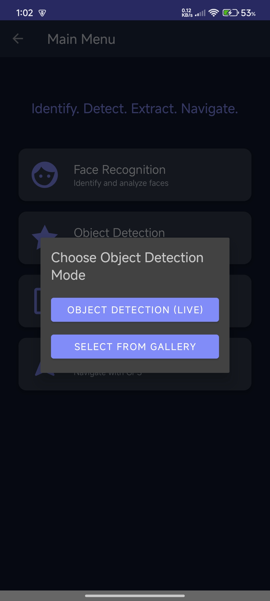
  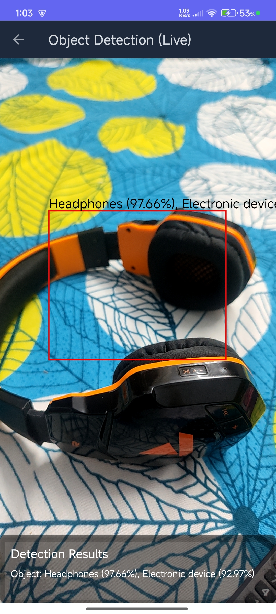
</div>
<div style="text-align: center;">
  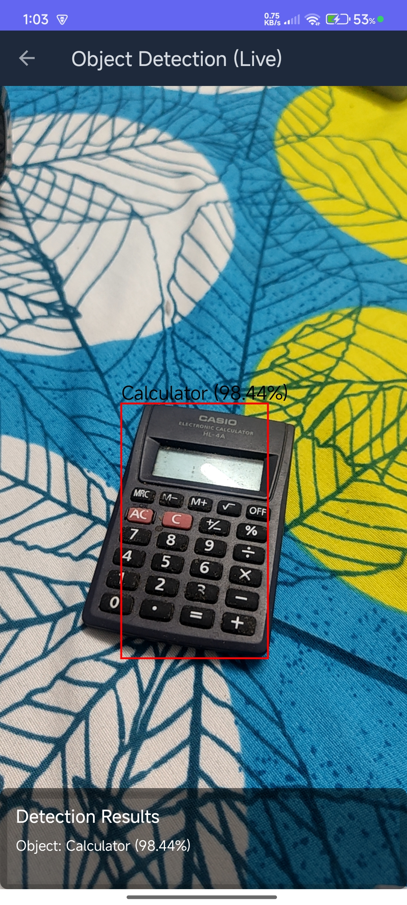
  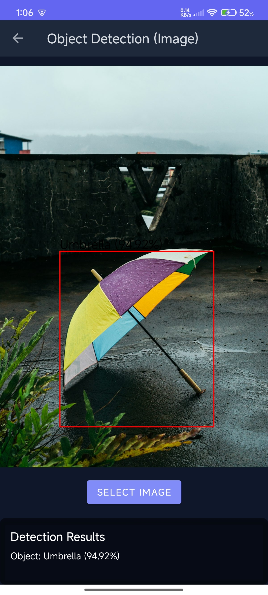
</div>
<div style="text-align: center;">
  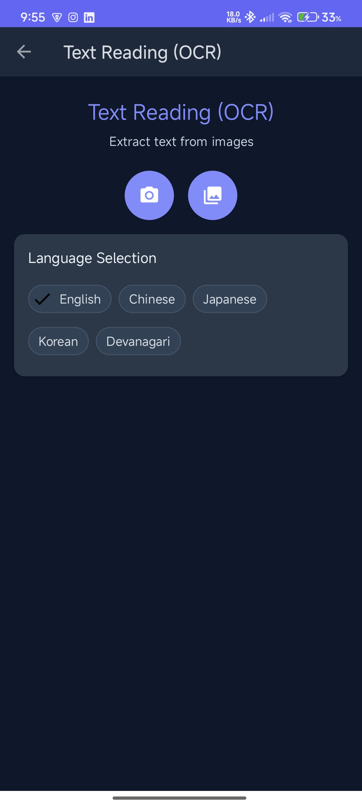
  
</div>

## Usage

### OCR (Optical Character Recognition)
1. **Navigate to OCR**: Open the app and tap "OCR" from the Main Menu.
2. **Select Language**: Choose your preferred language from the chip selection (English, Chinese, Japanese, Korean, or Devanagari).
3. **Capture or Select Image**:
   - **Camera Capture**: Tap the camera button to open the camera preview, then tap the capture button to take a photo
   - **Gallery Selection**: Tap the gallery button to select an image from your device's gallery
4. **View Results**: The app will display the recognized text with confidence score and detected language
5. **Copy or Share**: Use the copy button to copy text to clipboard or share button to share the text via other apps
6. **Try Again**: Tap camera or gallery buttons to process a new image

**Features:**
- **Multi-language Support**: Automatic language detection and manual language selection
- **Real-time Camera Preview**: Live camera feed with capture functionality
- **Image Preprocessing**: Automatic image optimization for better OCR accuracy
- **Text Post-processing**: Cleaned and formatted text output
- **Confidence Scoring**: Shows recognition confidence percentage
- **Copy & Share**: Easy text copying and sharing capabilities

**Troubleshooting:**
- If camera permission is denied, grant it from system settings and try again
- If storage permission is denied (Android 12 and lower), grant it from system settings
- Very large images may take a moment to process; a progress bar shows while processing
- For best results, ensure text is clearly visible and well-lit in the image
- Try different language settings if recognition accuracy is low

### Face Recognition
1. Open the app and navigate to Face Recognition from the Main Menu.
2. Tap "Capture Image" to take a photo or "Pick Image" to select from gallery.
3. The app draws green bounding boxes around detected faces and shows the face count and details.
4. Tap "Clear" to reset the view.

Troubleshooting:
- If camera permission is denied, grant it from system settings and try again.
- Very large images may take a moment to process; a spinner shows while detecting.


### Google Sign-In Setup
1. **Firebase Console Setup:**
   - Enable Google Sign-In in Firebase Console
   - Add your app's SHA-1 fingerprint to project settings
   - Download updated `google-services.json`

2. **SHA-1 Fingerprint:**
   - For debug: `keytool -list -v -keystore ~/.android/debug.keystore -alias androiddebugkey -storepass android -keypass android`
   - For release: Use your release keystore

3. **Testing:**
   - Run the app
   - Tap "Sign in with Google" button
   - Complete Google Sign-In flow
   - View user profile information
   - Use "Sign Out" to log out

### Navigation
- **Main Menu:** Default start destination with four core feature options
- **Home Screen:** Shows current user info and navigation options (which includes Anonymous Sign-in and Go to Sign-in Buttons)
- **Feature Screens:** Face Recognition and OCR are fully implemented. Object Detection and Navigation are placeholders.

### Main Menu Navigation Testing

1. **Launch the App:**
   - The app will start at the Main Menu screen
   - You'll see four cards: Face Recognition, Object Detection, OCR, and Navigation

2. **Test Navigation to Features:**
   - Tap on Face Recognition to try the live face detection feature
   - Tap on OCR to try the live text recognition feature
   - Object Detection and Navigation cards navigate to placeholder screens with a "coming soon" message
   - Use the back button or action bar back arrow to return to the main menu

3. **Test Responsive Layout:**
   - Rotate the device to test landscape orientation
   - The cards will adjust to maintain proper spacing and readability
   - Test on different screen sizes (phone, tablet) if available

4. **Test Back Navigation:**
   - From any feature screen, press the back button
   - You should return to the main menu
   - The action bar should show the correct title for each screen

5. **Access Main Menu from Home:**
   - Navigate to the Home screen using the "Go to Main Menu" button
   - This provides an alternative way to access the main menu

### Firebase Cloud Messaging (FCM) Setup & Testing

### How to Test Push Notifications

1. **Get Device FCM Token:**
   - Run the app. The FCM token will be logged in Logcat with tag `FCM_TOKEN` and shown as a Toast on app start.
   - Copy this token for use in Firebase Console.
2. **Send Test Notification:**
   - Go to Firebase Console > Cloud Messaging > Send your first message.
   - Enter a title and message.
   - Under 'Target', select 'Single device' and paste your device's FCM token.
   - Send the message.
3. **Observe Notification:**
   - If the app is in foreground, a Toast will display the message.
   - If the app is in background or killed, a notification will appear in the system tray.

### Notes
- The app logs and displays the FCM token on every launch.
- The app handles both notification and data payloads.
- The FCM service is declared in the manifest and handles token refresh automatically.

## OCR Technical Implementation

### Architecture
- **Fragment-based UI**: `OcrFragment.kt` handles user interactions and UI updates
- **Utility Class**: `OcrUtils.kt` provides OCR processing and image preprocessing
- **CameraX Integration**: Real-time camera preview with `PreviewView` and `ImageCapture`
- **ML Kit Text Recognition**: On-device text recognition with language-specific recognizers

### Key Components

#### 1. Language Support
```kotlin
enum class Language {
    ENGLISH, CHINESE, JAPANESE, KOREAN, DEVANAGARI
}
```
- **English**: Default ML Kit recognizer
- **Chinese**: Chinese-specific recognizer for better accuracy
- **Japanese**: Japanese-specific recognizer
- **Korean**: Korean-specific recognizer  
- **Devanagari**: Hindi/Sanskrit script support

#### 2. Image Processing Pipeline
1. **Image Loading**: Optimized bitmap loading with memory management
2. **Preprocessing**: Automatic resizing for large images (max 2048px)
3. **OCR Processing**: Language-specific text recognition
4. **Post-processing**: Text cleaning and artifact removal
5. **Result Display**: Formatted output with confidence scoring

#### 3. Camera Integration
- **CameraX**: Modern camera API with lifecycle management
- **Preview**: Real-time camera feed display
- **ImageCapture**: High-quality photo capture
- **Permissions**: Runtime permission handling for camera and storage

#### 4. UI Features
- **Language Selection**: Chip-based language picker
- **Camera Preview**: Live camera feed with capture button
- **Image Preview**: Display of captured/selected images
- **Text Results**: Formatted text display with confidence score
- **Action Buttons**: Copy to clipboard and share functionality
- **Theme Support**: Automatic light/dark theme adaptation

### Performance Optimizations
- **Memory Management**: Efficient bitmap loading and disposal
- **Async Processing**: Coroutine-based OCR processing
- **Image Resizing**: Automatic optimization for large images
- **Background Processing**: Non-blocking UI during OCR operations

### Error Handling
- **Permission Denied**: Graceful handling with user guidance
- **Image Loading Failures**: Error messages and fallback options
- **OCR Failures**: User-friendly error messages
- **No Text Detected**: Clear feedback to user

---

**Note:** This project is set up for easy extension and task experimentation. 

