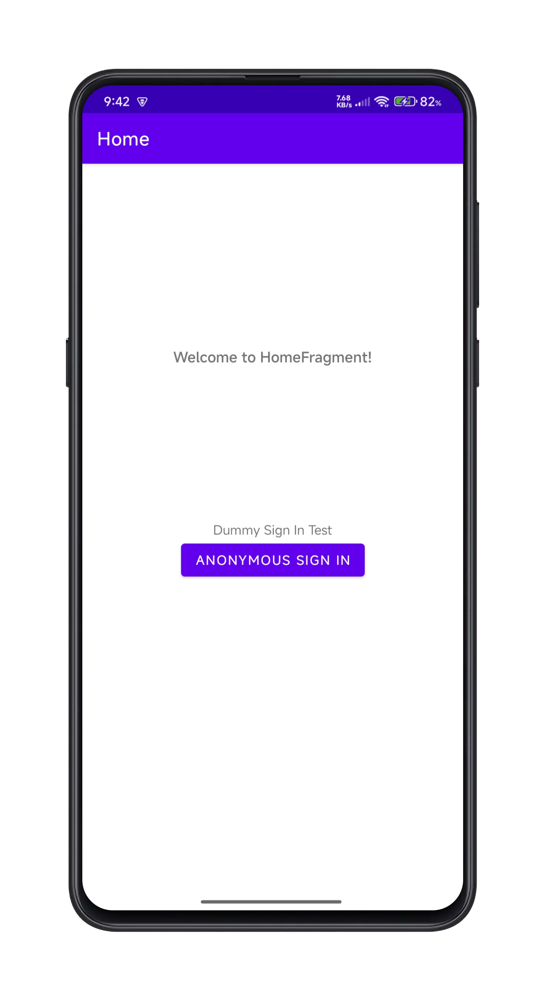
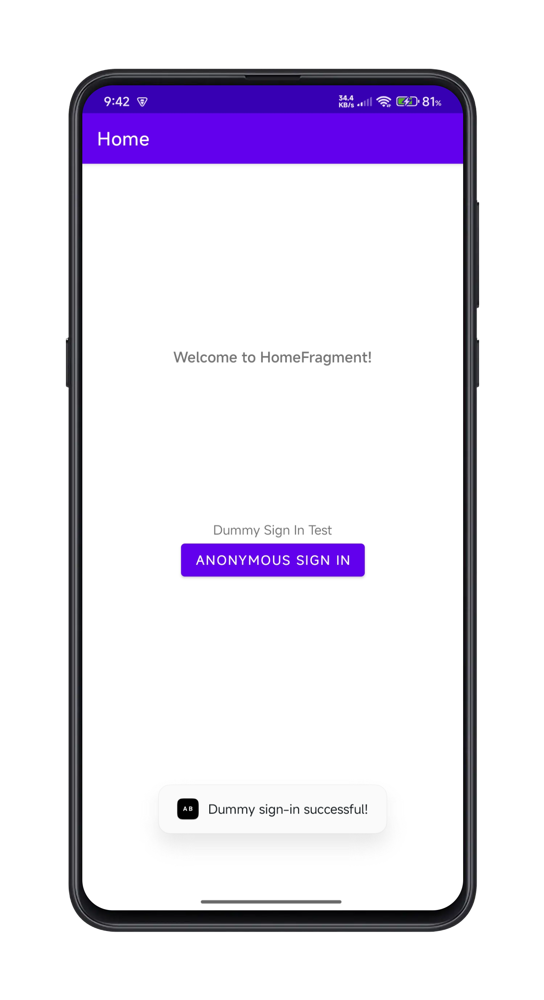

# App Base – High Level Documentation

## 1. Project Overview
App Base is a simple Android application demonstrating integration with Firebase services, including Analytics and Authentication. The app is structured using modern Android development practices, such as Fragments, View Binding, and Navigation Components. It serves as a template or starting point for more complex applications that require Firebase integration.

- **Platform:** Android
- **Language:** Kotlin
- **Main Libraries/Frameworks:** AndroidX, Firebase (Analytics, Auth), View Binding, Navigation Component

## 2. Key Features
- **Firebase Analytics Integration:** Logs a test event to Firebase Analytics when the user clicks the 'Anonymous Sign In' button.
- **Firebase Authentication:** Performs a dummy anonymous sign-in to Firebase Auth and displays the result to the user, only when the 'Anonymous Sign In' button is clicked.
- **Modern Android Architecture:** Uses Fragments, View Binding, and Navigation Component for clean code organization.
- **Simple UI:** Displays a welcome message and a button for anonymous sign-in on the Home screen.

## 3. Architecture Overview
### 3.1. App Structure
- **HomeFragment:** The main UI component, responsible for displaying the welcome message and handling the 'Anonymous Sign In' button click, which triggers Firebase test actions.
- **FirebaseTest (object):** Contains utility functions for logging analytics events and performing dummy sign-in.
- **Navigation:** Managed via `nav_graph.xml`, with HomeFragment as the start destination.

### 3.2. Firebase Integration
- **Analytics:** Logs a custom event (`test_event`) with a test key-value pair when the user clicks the 'Anonymous Sign In' button.
- **Auth:** Signs in the user anonymously and provides feedback via a Toast message, only when the button is clicked.

### 3.3. UI Layout
- **fragment_home.xml:** Contains a centered TextView with the message "Welcome to App Base!" and a button labeled 'Anonymous Sign In' below it.

## 4. Screenshots
### Home Screen with 'Anonymous Sign In' button


### Dummy Sign-In Toast


### Log Test Event


## 5. How to Run the Application
### 5.1. Prerequisites
- Android Studio (latest version recommended)
- Android SDK
- A valid `google-services.json` file from your Firebase Console (replace the placeholder in `app/`)

### 5.2. Setup Steps
1. **Clone the Repository:**
   ```sh
   git clone https://github.com/techsavvysanyam/App-Base
   ```
2. **Open in Android Studio:**
   Open the project folder in Android Studio.
3. **Add Firebase Configuration:**
   Replace the placeholder `google-services.json` in `app/` with your actual Firebase config file.
4. **Build the Project:**
   Let Gradle sync and build the project.
5. **Run the App:**
   Select an emulator or connected device and click "Run".

## 6. Code Structure
```
App Base/
├── app/
│   ├── src/
│   │   ├── main/
│   │   │   ├── java/com/example/appbase/
│   │   │   │   ├── HomeFragment.kt
│   │   │   │   └── FirebaseTest.kt
│   │   │   ├── res/
│   │   │   │   ├── layout/fragment_home.xml
│   │   │   │   └── navigation/nav_graph.xml
│   │   │   └── ...
│   ├── google-services.json (replace with your own)
├── build.gradle
├── settings.gradle
└── ...
```

## 7. Future Enhancements
- Add more screens and navigation destinations.
- Implement user profile and authentication flows.
- Integrate additional Firebase services (e.g., Firestore, Cloud Messaging).
- Improve UI/UX with more interactive elements.

## 8. References
- [Firebase for Android Documentation](https://firebase.google.com/docs/android/setup)
- [Android Developer Guide](https://developer.android.com/guide)

