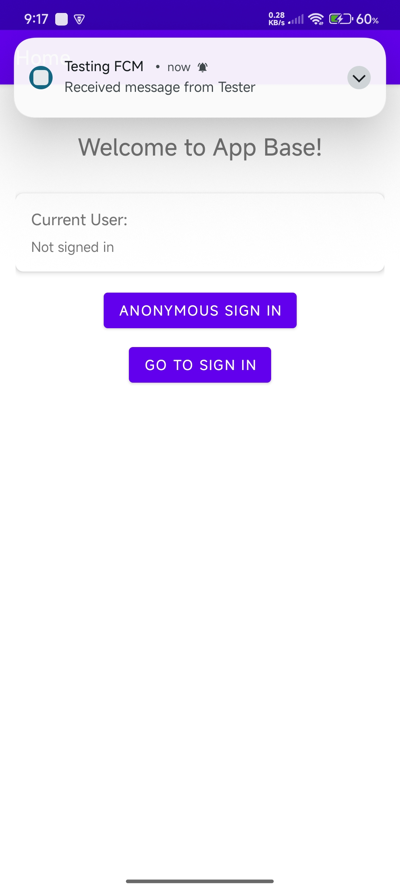
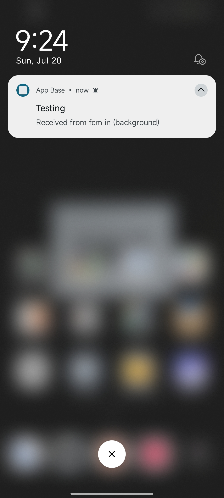

# App Base

A starter Android app using Kotlin, AndroidX, ViewBinding, Navigation Component, and Firebase (Auth + FCM) with Google Sign-In integration.

## Setup

1. Open this project in Android Studio Meerkat 2024.3.2 Patch 1 or newer.
2. Download your `google-services.json` from Firebase Console and place it in `app/`.
3. Enable Google Sign-In in Firebase Console:
   - Go to Firebase Console > Authentication > Sign-in method
   - Enable Google Sign-In provider
   - Add your app's SHA-1 fingerprint to the project settings
4. Sync Gradle and run the app.

## Features
- Single-Activity architecture with Navigation Component
- Sign-In screen with Google authentication
- User profile display with photo, name, and email
- Sign-out functionality
- Firebase Authentication and Cloud Messaging (FCM) integrated
- Anonymous authentication support

## Dependencies
- AndroidX
- Kotlin
- Navigation Component
- Firebase Auth
- Firebase Cloud Messaging
- Google Play Services Auth
- Glide (for image loading)

## 📸 Screenshots

  
  

  
  

  
  

  
  

## Usage

### Google Sign-In Setup
1. **Firebase Console Setup:**
   - Enable Google Sign-In in Firebase Console
   - Add your app's SHA-1 fingerprint to project settings
   - Download updated `google-services.json`

2. **SHA-1 Fingerprint:**
   - For debug: `keytool -list -v -keystore ~/.android/debug.keystore -alias androiddebugkey -storepass android -keypass android`
   - For release: Use your release keystore

3. **Testing:**
   - Run the app
   - Tap "Sign in with Google" button
   - Complete Google Sign-In flow
   - View user profile information
   - Use "Sign Out" to log out

### Navigation
- **Sign-In Screen:** Default start destination with Google Sign-In
- **Home Screen:** Shows current user info and navigation options (which includes Anonymous Sign-in and Go to Sign-in Buttons)

### Firebase Cloud Messaging (FCM) Setup & Testing

### How to Test Push Notifications

1. **Get Device FCM Token:**
   - Run the app. The FCM token will be logged in Logcat with tag `FCM_TOKEN` and shown as a Toast on app start.
   - Copy this token for use in Firebase Console.
2. **Send Test Notification:**
   - Go to Firebase Console > Cloud Messaging > Send your first message.
   - Enter a title and message.
   - Under 'Target', select 'Single device' and paste your device's FCM token.
   - Send the message.
3. **Observe Notification:**
   - If the app is in foreground, a Toast will display the message.
   - If the app is in background or killed, a notification will appear in the system tray.

### Notes
- The app logs and displays the FCM token on every launch.
- The app handles both notification and data payloads.
- The FCM service is declared in the manifest and handles token refresh automatically.

---

**Note:** This project is set up for easy extension and task experimentation. 
