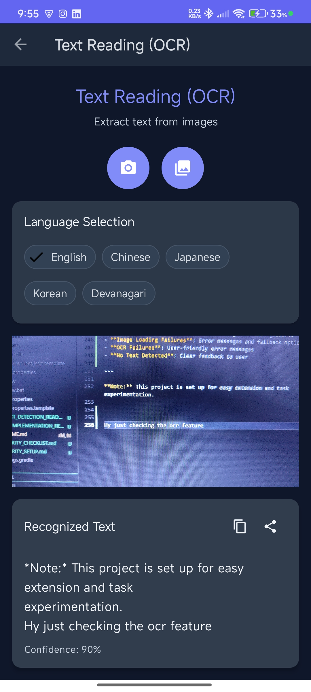
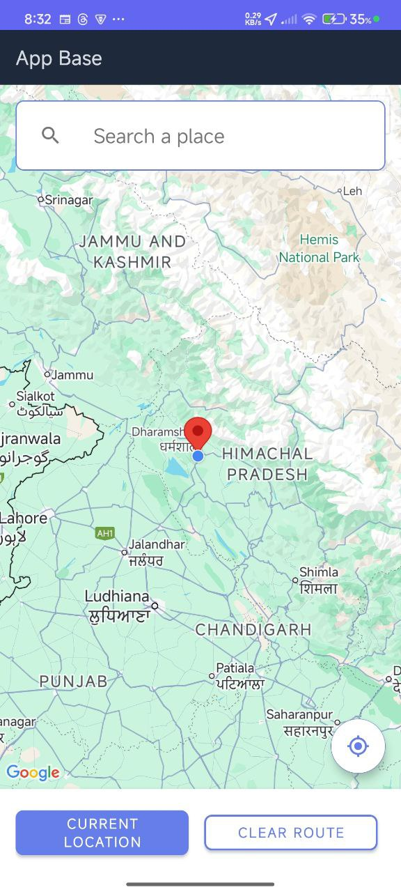

# App Base

A comprehensive Android app using Kotlin, AndroidX, ViewBinding, Navigation Component, and Firebase (Auth + FCM) with Google Sign-In integration. Features AI-powered capabilities including face recognition, object detection, OCR, navigation, and a complete user profile management system with settings and preferences.

## Setup

1. Open this project in Android Studio Meerkat 2024.3.2 Patch 1 or newer.
2. Download your `google-services.json` from Firebase Console and place it in `app/`.
3. Enable Google Sign-In in Firebase Console:
   - Go to Firebase Console > Authentication > Sign-in method
   - Enable Google Sign-In provider
   - Add your app's SHA-1 fingerprint to the project settings
4. Sync Gradle and run the app.

### Face Recognition Setup Notes
- No additional API keys required (on-device ML Kit face detection)
- Permissions handled at runtime: Camera, and Storage (only on Android 12 and lower)
- Uses Android 13+ Photo Picker when available (no storage permission needed)

### OCR Setup Notes
- No additional API keys required (on-device ML Kit text recognition)
- Permissions handled at runtime: Camera, and Storage (only on Android 12 and lower)
- Uses Android 13+ Photo Picker when available (no storage permission needed)
- Supports multiple languages: English, Chinese, Japanese, Korean, and Devanagari
- Automatic language detection based on recognized text patterns

### Navigation Setup Notes
- **Google Maps API Key Required**: Add your API key to `local.properties` file
- **Required APIs**: Enable in Google Cloud Console:
  - Maps SDK for Android
  - Places API (Legacy) - doesn't require billing
  - Directions API
- **Permissions**: Location permissions handled at runtime
- **Internet Required**: For map tiles, place search, and directions
- **Setup Guide**: See `NAVIGATION_API_SETUP_GUIDE.md` for detailed configuration

## Features

### Core Architecture
- Single-Activity architecture with Navigation Component
- Material Design 3 UI components with modern theming
- Responsive layout for different screen sizes
- Firebase Authentication and Cloud Messaging (FCM) integrated
- Anonymous authentication support

### AI-Powered Features
- **Face Recognition (ML Kit)**: capture or pick an image, on-device face detection, bounding boxes overlay, face count, and details
- **Object Detection (ML Kit)**: live camera detection and image-based object detection with confidence scores
- **OCR (Optical Character Recognition)**: extract text from images using ML Kit Text Recognition API with multi-language support, camera capture, gallery selection, and text sharing capabilities
- **Navigation (Google Maps)**: full-featured navigation with Google Maps integration, location services, place search, and route planning

### User Profile Management
- **Enhanced Profile System**: comprehensive user profile with bio, contact info, location, and website
- **Profile Completion Tracking**: visual progress indicator showing profile completion percentage
- **Profile Picture Management**: camera capture and gallery selection with real-time updates
- **Verification System**: account verification status with visual badges
- **Online Status**: real-time online/offline status indicators

### Settings & Preferences
- **Theme Management**: dark/light mode with auto theme following system settings
- **Notification Controls**: granular notification preferences (push, email, master toggle)
- **Language Selection**: 12 language options with immediate application
- **Persistent Storage**: DataStore-based preferences that survive app restarts
- **Real-time Updates**: immediate UI updates when settings change

### User Interface
- **Modern Design**: gradient headers, card-based layouts, and smooth animations
- **Intuitive Navigation**: organized action buttons and clear visual hierarchy
- **Loading States**: professional loading indicators with contextual messages
- **Error Handling**: user-friendly error messages and recovery options

## Dependencies

### Core Dependencies
- **AndroidX**: Modern Android libraries
- **Kotlin**: Primary programming language
- **Navigation Component**: Fragment-based navigation
- **ViewBinding**: Type-safe view binding
- **Material Design 3**: Modern UI components

### Firebase Integration
- **Firebase Auth**: User authentication
- **Firebase Cloud Messaging**: Push notifications
- **Firebase Firestore**: Cloud database
- **Firebase Storage**: File storage
- **Google Play Services Auth**: Google Sign-In

### AI & Machine Learning
- **ML Kit Face Detection**: On-device face recognition
- **ML Kit Object Detection**: On-device object detection
- **ML Kit Text Recognition**: Multi-language OCR
- **CameraX**: Modern camera integration

### UI & Utilities
- **Glide**: Image loading and caching
- **Kotlin Coroutines**: Asynchronous programming
- **DataStore Preferences**: Modern preference storage
- **Google Maps SDK**: Interactive maps
- **Google Places API**: Place search and autocomplete
- **Google Directions API**: Route planning and navigation

## 📸 Screenshots

<!--suppress ALL -->
<div style="text-align: center;">
  
  
</div>

<div style="text-align: center;">
  
  
</div>

<div style="text-align: center;">
  
  
</div>

<div style="text-align: center;">
  
  
</div>

<div style="text-align: center;">
  
  
</div>
<div style="text-align: center;">
  
  
</div>
<div style="text-align: center;">
  
  
</div>
<div style="text-align: center;">
  
  
</div>
<div style="text-align: center;">
  
  
</div>
<div style="text-align: center;">
  
</div>

## Usage..

### OCR (Optical Character Recognition)
1. **Navigate to OCR**: Open the app and tap "OCR" from the Main Menu.
2. **Select Language**: Choose your preferred language from the chip selection (English, Chinese, Japanese, Korean, or Devanagari).
3. **Capture or Select Image**:
   - **Camera Capture**: Tap the camera button to open the camera preview, then tap the capture button to take a photo
   - **Gallery Selection**: Tap the gallery button to select an image from your device's gallery
4. **View Results**: The app will display the recognized text with confidence score and detected language
5. **Copy or Share**: Use the copy button to copy text to clipboard or share button to share the text via other apps
6. **Try Again**: Tap camera or gallery buttons to process a new image

**Features:**
- **Multi-language Support**: Automatic language detection and manual language selection
- **Real-time Camera Preview**: Live camera feed with capture functionality
- **Image Preprocessing**: Automatic image optimization for better OCR accuracy
- **Text Post-processing**: Cleaned and formatted text output
- **Confidence Scoring**: Shows recognition confidence percentage
- **Copy & Share**: Easy text copying and sharing capabilities

**Troubleshooting:**
- If camera permission is denied, grant it from system settings and try again
- If storage permission is denied (Android 12 and lower), grant it from system settings
- Very large images may take a moment to process; a progress bar shows while processing
- For best results, ensure text is clearly visible and well-lit in the image
- Try different language settings if recognition accuracy is low

### Navigation (Google Maps)
1. **Open Navigation**: Tap "Navigation" from the Main Menu to open the full-featured Google Maps navigation
2. **Grant Location Permissions**: Allow location access when prompted for current location functionality
3. **Search for Places**: Use the search bar to find destinations with autocomplete suggestions
4. **Get Current Location**: Tap "Current Location" button to center the map on your current position
5. **Select Destination**: Choose a place from search results to set as your destination
6. **Get Directions**: Tap "Navigate" to get driving directions with route visualization
7. **View Route Info**: See distance and estimated travel time for your selected route
8. **Clear Route**: Tap "Clear Route" to remove the current route and start over

**Features:**
- **Interactive Google Maps**: Full-screen map with zoom, pan, and map type controls
- **Location Services**: Real-time current location tracking with GPS
- **Place Search**: Google Places API integration with autocomplete suggestions
- **Route Planning**: Google Directions API for driving directions and route visualization
- **Visual Route Display**: Polylines showing the complete route on the map
- **Distance & Duration**: Real-time route information display
- **Modern UI**: Material Design interface with floating action buttons

**Setup Requirements:**
- **Google Maps API Key**: Configure in `local.properties` file
- **Required APIs**: Enable Maps SDK for Android, Places API (Legacy), and Directions API in Google Cloud Console
- **Location Permissions**: Fine and coarse location permissions for GPS functionality
- **Internet Connection**: Required for map tiles, place search, and directions

**Troubleshooting:**
- If location permission is denied, grant it from system settings
- If search doesn't work, check your Google Maps API key configuration
- If routes don't display, verify Directions API is enabled in Google Cloud Console
- For best results, use the app in areas with good GPS signal

### Enhanced Profile Management
1. **Access Profile**: Navigate to Profile from the Home screen or Main Menu
2. **View Profile Information**: See your comprehensive profile with completion progress
3. **Edit Profile Details**: 
   - **Display Name**: Your primary name
   - **Bio**: Personal or professional biography
   - **Phone Number**: Contact information
   - **Location**: Geographic location
   - **Website**: Personal or professional website
4. **Update Profile Picture**: Tap "Change Photo" to capture or select a new image
5. **Track Progress**: Monitor your profile completion percentage
6. **Save Changes**: Tap "Save Profile" to update your information
7. **Sync with Google**: Use "Sync with Google" to update from your Google account

**Features:**
- **Modern UI**: Gradient header with profile picture and status indicators
- **Profile Completion**: Visual progress bar showing completion percentage
- **Verification Badge**: Shows verified account status
- **Online Status**: Real-time online/offline indicator
- **Comprehensive Fields**: All necessary profile information in one place
- **Real-time Updates**: Immediate UI updates when changes are made
- **Image Management**: Easy profile picture updates with camera or gallery

### Settings & Preferences
1. **Access Settings**: Navigate to Settings from Profile screen or Main Menu
2. **Notification Settings**:
   - **Master Toggle**: Enable/disable all notifications
   - **Push Notifications**: Control device notifications
   - **Email Notifications**: Manage email notifications
3. **Appearance Settings**:
   - **Auto Theme**: Follow system theme settings
   - **Dark Theme**: Force dark mode when auto theme is disabled
4. **Language Settings**:
   - **Language Selection**: Choose from 12 supported languages
   - **Immediate Application**: Language changes apply instantly
5. **About Information**: View app version and description

**Features:**
- **Persistent Storage**: All settings saved using DataStore
- **Real-time Updates**: Changes apply immediately
- **Theme Management**: Seamless dark/light mode switching
- **Language Support**: 12 languages with proper localization
- **Organized UI**: Card-based layout with clear sections
- **User Feedback**: Toast messages confirm changes

**Supported Languages:**
- English, Spanish, French, German, Chinese, Japanese, Korean, Arabic, Hindi, Portuguese, Russian, Italian

### Face Recognition
1. Open the app and navigate to Face Recognition from the Main Menu.
2. Tap "Capture Image" to take a photo or "Pick Image" to select from gallery.
3. The app draws green bounding boxes around detected faces and shows the face count and details.
4. Tap "Clear" to reset the view.

Troubleshooting:
- If camera permission is denied, grant it from system settings and try again.
- Very large images may take a moment to process; a spinner shows while detecting.


### Google Sign-In Setup
1. **Firebase Console Setup:**
   - Enable Google Sign-In in Firebase Console
   - Add your app's SHA-1 fingerprint to project settings
   - Download updated `google-services.json`

2. **SHA-1 Fingerprint:**
   - For debug: `keytool -list -v -keystore ~/.android/debug.keystore -alias androiddebugkey -storepass android -keypass android`
   - For release: Use your release keystore

3. **Testing:**
   - Run the app
   - Tap "Sign in with Google" button
   - Complete Google Sign-In flow
   - View user profile information
   - Use "Sign Out" to log out

### Navigation
- **Main Menu:** Default start destination with four core feature options
- **Home Screen:** Shows current user info and navigation options (which includes Anonymous Sign-in and Go to Sign-in Buttons)
- **Feature Screens:** Face Recognition, OCR, and Navigation are fully implemented. Object Detection is a placeholder.

### Main Menu Navigation Testing

1. **Launch the App:**
   - The app will start at the Main Menu screen
   - You'll see four cards: Face Recognition, Object Detection, OCR, and Navigation

2. **Test Navigation to Features:**
   - Tap on Face Recognition to try the live face detection feature
   - Tap on OCR to try the live text recognition feature
   - Tap on Navigation to open the full-featured Google Maps navigation
   - Object Detection card navigates to a placeholder screen with a "coming soon" message
   - Use the back button or action bar back arrow to return to the main menu

3. **Test Responsive Layout:**
   - Rotate the device to test landscape orientation
   - The cards will adjust to maintain proper spacing and readability
   - Test on different screen sizes (phone, tablet) if available

4. **Test Back Navigation:**
   - From any feature screen, press the back button
   - You should return to the main menu
   - The action bar should show the correct title for each screen

5. **Access Main Menu from Home:**
   - Navigate to the Home screen using the "Go to Main Menu" button
   - This provides an alternative way to access the main menu

### Firebase Cloud Messaging (FCM) Setup & Testing

### How to Test Push Notifications

1. **Get Device FCM Token:**
   - Run the app. The FCM token will be logged in Logcat with tag `FCM_TOKEN` and shown as a Toast on app start.
   - Copy this token for use in Firebase Console.
2. **Send Test Notification:**
   - Go to Firebase Console > Cloud Messaging > Send your first message.
   - Enter a title and message.
   - Under 'Target', select 'Single device' and paste your device's FCM token.
   - Send the message.
3. **Observe Notification:**
   - If the app is in foreground, a Toast will display the message.
   - If the app is in background or killed, a notification will appear in the system tray.

### Notes
- The app logs and displays the FCM token on every launch.
- The app handles both notification and data payloads.
- The FCM service is declared in the manifest and handles token refresh automatically.

## OCR Technical Implementation

### Architecture
- **Fragment-based UI**: `OcrFragment.kt` handles user interactions and UI updates
- **Utility Class**: `OcrUtils.kt` provides OCR processing and image preprocessing
- **CameraX Integration**: Real-time camera preview with `PreviewView` and `ImageCapture`
- **ML Kit Text Recognition**: On-device text recognition with language-specific recognizers

### Key Components

#### 1. Language Support
```kotlin
enum class Language {
    ENGLISH, CHINESE, JAPANESE, KOREAN, DEVANAGARI
}
```
- **English**: Default ML Kit recognizer
- **Chinese**: Chinese-specific recognizer for better accuracy
- **Japanese**: Japanese-specific recognizer
- **Korean**: Korean-specific recognizer  
- **Devanagari**: Hindi/Sanskrit script support

#### 2. Image Processing Pipeline
1. **Image Loading**: Optimized bitmap loading with memory management
2. **Preprocessing**: Automatic resizing for large images (max 2048px)
3. **OCR Processing**: Language-specific text recognition
4. **Post-processing**: Text cleaning and artifact removal
5. **Result Display**: Formatted output with confidence scoring

#### 3. Camera Integration
- **CameraX**: Modern camera API with lifecycle management
- **Preview**: Real-time camera feed display
- **ImageCapture**: High-quality photo capture
- **Permissions**: Runtime permission handling for camera and storage

#### 4. UI Features
- **Language Selection**: Chip-based language picker
- **Camera Preview**: Live camera feed with capture button
- **Image Preview**: Display of captured/selected images
- **Text Results**: Formatted text display with confidence score
- **Action Buttons**: Copy to clipboard and share functionality
- **Theme Support**: Automatic light/dark theme adaptation

### Performance Optimizations
- **Memory Management**: Efficient bitmap loading and disposal
- **Async Processing**: Coroutine-based OCR processing
- **Image Resizing**: Automatic optimization for large images
- **Background Processing**: Non-blocking UI during OCR operations

### Error Handling
- **Permission Denied**: Graceful handling with user guidance
- **Image Loading Failures**: Error messages and fallback options
- **OCR Failures**: User-friendly error messages
- **No Text Detected**: Clear feedback to user

## Navigation Technical Implementation

### Architecture
- **Activity-based UI**: `NavigationActivity.kt` handles full-screen navigation interface
- **Utility Classes**: `LocationManager.kt` and `DirectionsManager.kt` provide specialized functionality
- **Google Maps Integration**: Native Android Maps SDK with custom controls
- **Places API Integration**: Legacy Places API for place search and autocomplete

### Key Components

#### 1. Location Services
```kotlin
class LocationManager(private val context: Context) {
    suspend fun getCurrentLocation(): Location?
    fun getLocationUpdates(): Flow<Location>
    fun hasLocationPermission(): Boolean
}
```
- **FusedLocationProviderClient**: Google's recommended location provider
- **Real-time Updates**: Continuous location tracking with configurable intervals
- **Permission Management**: Runtime permission handling and validation
- **Distance Calculations**: Utility functions for location-based calculations

#### 2. Directions API Integration
```kotlin
class DirectionsManager(private val context: Context, private val apiKey: String) {
    suspend fun getDirections(origin: LatLng, destination: LatLng): Result<RouteInfo>
    suspend fun getTravelTime(origin: LatLng, destination: LatLng): Result<String>
}
```
- **HTTP-based Implementation**: Direct API calls to Google Directions API
- **Polyline Decoding**: Custom algorithm for route visualization
- **Route Information**: Distance and duration parsing from API responses
- **Error Handling**: Comprehensive error management and user feedback

#### 3. Places API Integration
- **AutocompleteSupportFragment**: Built-in place search with suggestions
- **Place Selection**: Automatic destination setting from search results
- **Legacy API**: Uses Places API (Legacy) that doesn't require billing
- **Real-time Search**: Live autocomplete as user types

#### 4. Map Features
- **Interactive Maps**: Full Google Maps functionality with custom controls
- **Marker Management**: Current location and destination markers
- **Route Visualization**: Polylines with custom styling and colors
- **Camera Controls**: Automatic centering and zoom management
- **Floating Action Button**: Quick access to current location

### Performance Optimizations
- **Memory Management**: Efficient marker and polyline management
- **Async Operations**: Coroutine-based location and API operations
- **Request Caching**: Optimized API calls and response handling
- **Background Processing**: Non-blocking UI during location updates

### Error Handling
- **Location Errors**: Graceful handling of GPS and permission issues
- **API Failures**: User-friendly error messages for network issues
- **Permission Denied**: Clear guidance for enabling location access
- **Network Issues**: Offline map support and retry mechanisms

### Security Considerations
- **API Key Protection**: Secure storage in local.properties
- **Location Privacy**: User consent and permission management
- **Request Validation**: Input sanitization and validation
- **Error Logging**: Comprehensive logging without sensitive data exposure

## Enhanced Profile & Settings Technical Implementation

### Profile Management Architecture
- **Fragment-based UI**: `ProfileFragment.kt` handles user interactions and profile display
- **Data Model**: Enhanced `UserProfile.kt` with comprehensive user information
- **Repository Pattern**: `ProfileRepository.kt` manages data persistence and Firebase integration
- **Image Management**: Glide integration for profile picture loading and caching

### Key Profile Components

#### 1. Enhanced User Profile Model
```kotlin
data class UserProfile(
    val uid: String = "",
    val displayName: String = "",
    val email: String = "",
    val photoUrl: String = "",
    val bio: String? = null,
    val phoneNumber: String? = null,
    val location: String? = null,
    val website: String? = null,
    val isVerified: Boolean = false,
    val isOnline: Boolean = false,
    val createdAt: Long = System.currentTimeMillis(),
    val updatedAt: Long = System.currentTimeMillis()
)
```

#### 2. Profile Completion System
- **Dynamic Calculation**: Real-time completion percentage based on filled fields
- **Visual Progress**: Material Design progress indicator with percentage display
- **Contextual Messages**: Different completion messages based on progress level
- **Field Validation**: Comprehensive validation for all profile fields

#### 3. Modern UI Components
- **Gradient Header**: Beautiful gradient background with profile picture
- **Status Indicators**: Online/offline status and verification badges
- **Card-based Layout**: Organized sections with Material Design cards
- **Responsive Design**: Adapts to different screen sizes and orientations

### Settings & Preferences Architecture
- **DataStore Integration**: `SettingsDataStore.kt` for modern preference storage
- **Fragment-based UI**: `SettingsFragment.kt` with organized settings sections
- **Reactive Updates**: Kotlin Flow-based real-time preference updates
- **Theme Management**: `LanguageHelper.kt` for language and theme management

### Key Settings Components

#### 1. Preference Storage
```kotlin
class SettingsDataStore(private val context: Context) {
    // Notification preferences
    val notificationsEnabled: Flow<Boolean>
    val pushNotificationsEnabled: Flow<Boolean>
    val emailNotificationsEnabled: Flow<Boolean>
    
    // Theme preferences
    val darkThemeEnabled: Flow<Boolean>
    val autoThemeEnabled: Flow<Boolean>
    
    // Language preferences
    val selectedLanguage: Flow<String>
}
```

#### 2. Theme Management
- **Auto Theme**: Follows system theme settings automatically
- **Manual Override**: Dark/light mode when auto theme is disabled
- **Real-time Application**: Immediate theme changes without app restart
- **Conflict Resolution**: Proper handling of theme conflicts

#### 3. Language Support
- **12 Languages**: Comprehensive language support with proper localization
- **Immediate Application**: Language changes apply instantly
- **Persistent Storage**: Language preferences survive app restarts
- **Fallback Handling**: Graceful fallback to default language

### Performance Optimizations
- **Memory Management**: Efficient image loading and caching with Glide
- **Async Operations**: Coroutine-based profile and settings operations
- **DataStore Efficiency**: Type-safe preference storage with minimal overhead
- **UI Optimization**: Smooth animations and transitions

### Error Handling
- **Profile Errors**: Graceful handling of profile loading and saving failures
- **Settings Errors**: User-friendly error messages for preference changes
- **Network Issues**: Offline support and retry mechanisms
- **Validation Errors**: Clear feedback for invalid input

---

**Note:** This project is set up for easy extension and task experimentation. The enhanced profile and settings system provides a solid foundation for building comprehensive user management features. 

